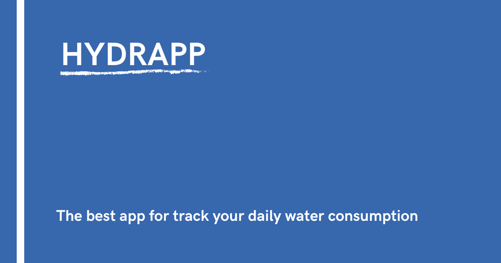

# HYDRAPP

## Tabel of contents

- [General info](#general-info)
- [Technologies](#technologies)
- [Setup](#setup)
- [Demo](#demo)
- [Features](#features)
- [To-do list](#to-do-list)
- [Status](#status)
- [Sources](#sources)
- [Contact](#contact)

## General info

Hydrapp is an application for counting the glasses drunk during the day. Thanks to it, you can track our daily water consumption.
This project is being developed in progress of course **_WTF: Co ten frontend_**.
Its purpose is to learn the basics of the frontend and this website was created to show this knowledge in practice.

## Technologies

- HTML 5
- SASS -SCSS
- BEM
- RWD
- Mobile first
- Vanilla JS
- Local storage
- PWA
- flex box
- webpack

## Setup

In console type `npm install` then choose one of the options:

`npm run start` - runs development mode

`npm run build` - runs build process for production

`npm run publish` - runs build process and publish the page using `gh-pages` branch

## Demo

Demo version of this project: [Link](https://skalutki.github.io/HYDRAPP/)

## Features

- You can track our daily water consumption

## To-do list:

- History of water consumption

## Status

Project is: in progress, I'm still learning JS and trying to use new knowledge in practice!

## Sources

This web is inspire by Maciej Korsan and tutorial by [WTF: Co ten frontend](https://cotenfrontend.pl/)

## Contact

Created by skalutki <skalutki@gmail.com> - feel free to contact me!
